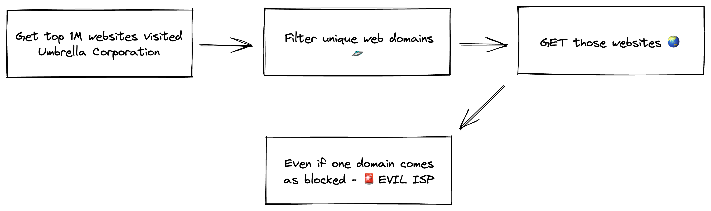
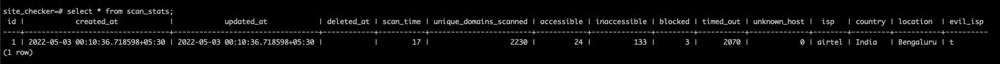
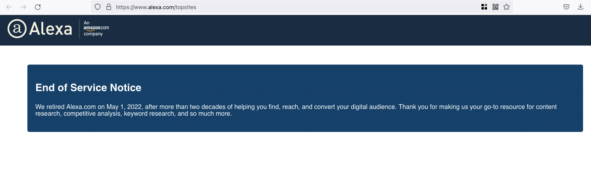

# is-your-isp-blocking-you
A tool to check if the ISP is blocking you for any of the Alexa top 1M websites

## Architecture

## Screenshots

## Generic Validator
### Methods
`TODO : Add all methods of censorship.`
1. `PR_CONNECT_RESET` - `RST` packet, in return.
2. Check final redirect to http://www.airtel.in/dot/
3. Redirected page has string : "The website has been blocked as per order of Ministry of Electronics and Information Technology under IT Act, 2000." (http://www.airtel.in/dot/)

## Methodology
TODO

## Datasets
1. `data/citizenlabs-lists` - https://github.com/citizenlab/test-lists
2. `data/India/potentially_blocked_unique_hostnames.txt` - https://github.com/kush789/How-India-Censors-The-Web-Data/blob/master/potentially_blocked_unique_hostnames.txt
3. `data/India/airtel-fiber-blocked-hosts.txt` - https://github.com/captn3m0/airtel-blocked-hosts
4. `data/India/act_blocked_list_26_may.txt` - https://github.com/qurbat/blocked-hosts/blob/main/output/may_26_2022-blocked_hosts.txt

## ToDo :
- [x] Option to use restricted domains from lists like : [CitizenLabs/test-lists](https://github.com/citizenlab/test-lists), [Domains Project](https://github.com/tb0hdan/domains) etc
- [x] Create this as a CLI tool. See bubble tea golang lib.
- [ ] d3.js or some other tool to create a heat map
- [x] Replace http client with retryable http client - https://github.com/hashicorp/go-retryablehttp
- [x] Keep in DB stats for last run, like : 1. Scan Time 2. Domains scanned 3. Accessible, Non-accessible, blocked, connection timed out domains 4. Location 5. ISP 6. Evil or not 7. Time of scan 8. Type of filtering
- [x] Save all data as base64 encoded into file.
- [ ] Create an un-censored source of truth.
- [ ] Check with some un-censored source of truth.
- [ ] Add `goreleaser` to automatically publish new version
- [ ] Can check for `www` subdomain, where the answer to a `GET` request is `no such host`.
- [ ] **Better Blocking Check** : Can check if page is blocked by checking similarity from a non-blocked source ( like a s3 bucket that saves the pages daily ) ?
- [ ] Try out bypasses for common techniques. Keep this as an option in the cli tool.
- [ ] Run multiple times, to avoid flaky results
- [ ] Decide number of goroutines on the basis of internet connection. A low bandwidth connection will get choked and all websites' will get timed out. Also timeout should be decided on this basis. Can use [speedtest-go](https://github.com/showwin/speedtest-go).
- [ ] Keep unique domains in the list to scan and remove subdomains - Currently 264k unique domains. Takes ~1330 seconds on a ~200Mbps internet connection with 15 second timeout and 3 retries. Try to get this to max 100k domains
- [ ] Optimise DB connections : https://gorm.io/docs/generic_interface.html#Connection-Pool

## ToDo CLI :
- [x] Add `proxy` support to run checks for different ISPs anywhere in the world.
- [x] Based on country automatically choose the list from `citizenlabs`.
- [x] Option to save stats in DB - sqlite, postgres etc.
- [ ] `debug` option to print all data like which websites were `blocked`, `inaccessible`, `accessible` etc.
- [ ] When choosing `cisco` list warn people about the bandwidth usage and how much data + time it might consume.
- [ ] Update `README` with the way it is being checked. Mentioning each of the block strategies and how different ISPs are using it. How the tool is checking these ?
- [ ] Check DNS filtering using `net.LookupIP` or server IP from the request's response .

## ToDo Server :
- [ ] Create a serverless lambda to send data to.
- [ ] Figure out IP and in turn ISP to be inserted into the DB
- [ ] Give user option in CLI tool to send data to their server
- [ ] Open source this server

## FAQ :
1. Why isn't alexa top 1 M included in the list ?
  Because alexa service is discontinued, as of 1st May 2022, check [here](https://www.alexa.com/topsites). 

## References
TODO : Add all references of methods of censorship.
